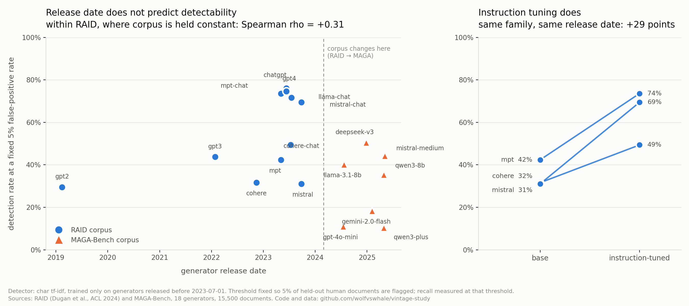

# vintage-study

Does a machine-text detector get worse as the generator that wrote the text gets newer?

Almost everyone in the field assumes it does. Nobody had drawn the curve. This draws it, across 18 generators released between February 2019 and May 2025, and the answer is no.



## The result

Train a detector on generators released before July 2023, fix its threshold so exactly 5% of held-out human documents are flagged, then measure per-generator recall at that fixed false-positive rate.

Within RAID, where corpus and genre are held constant, the rank correlation between release date and detection rate is **positive**: +0.31, +0.34, and +0.42 for the three detectors tested. Newer generators in that corpus are *more* detectable, not less.

The correlation flips negative when you pool RAID with MAGA-Bench (−0.26 and −0.55 for the two n-gram detectors), and every post-2024 generator lives in MAGA. So the pooled number is measuring the corpus boundary, not the passage of time.

What does predict detectability is instruction tuning. RAID contains three families where a base model and its instruction-tuned sibling shipped on the same date:

| family | base | instruction-tuned | difference |
|---|---|---|---|
| MPT | 42.4% | 73.6% | +31.3 |
| Cohere | 31.6% | 49.4% | +17.8 |
| Mistral | 31.0% | 69.5% | +38.4 |

Same release date, same model family, same corpus, same detector. Instruction tuning moves detection rate by 26 to 29 points on average, which is larger than anything the date column does.

This independently reproduces the central finding of [Base Models Look Human To AI Detectors](https://arxiv.org/abs/2605.19516) (May 2026), which reached it from Llama-3 and Qwen-3 with a different method. Here it falls out of MPT, Cohere, and Mistral from 2022 and 2023.

## The finding that surprised me

The three detectors do not agree, and where they disagree is the interesting part.

| detector | RAID mean | MAGA mean | gap |
|---|---|---|---|
| char TF-IDF | 55.4% | 30.0% | −25.4 |
| word TF-IDF | 51.6% | 18.9% | −32.7 |
| style features | 50.2% | 53.3% | **+3.0** |

Both n-gram detectors collapse when the corpus changes. The interpretable style-feature detector, built from sentence-length variance, paragraph shape, punctuation rates, and lexical diversity, does not move at all.

If that holds up, a good deal of what the literature reports as detector degradation on newer models is surface-feature brittleness rather than anything about the models. Structural features survive the shift that breaks n-grams.

## Controls

**Length.** Median document length per generator against detection rate: rho = +0.03. Length is not driving this.

**Training contamination.** Generators used for training have 30% of their documents held out; recall for them is measured only on that held-out slice.

**Human class.** Human documents have no vintage, so the same held-out human pool is used for every generator. Any movement in the curve comes from the machine side.

**Threshold.** Fixed by the human class, not chosen to maximise accuracy. Reporting raw accuracy would let a detector look better on a generator by becoming more trigger-happy.

## What this does not show

**Vintage and capability are entangled** and this design cannot separate them. GPT-2 is both old and small. A 2025 model is both new and better. Some of the flat curve may be two effects cancelling.

**The MAGA comparison is confounded.** Corpus, genre, and prompt construction all change at the same boundary as the date. Only the within-RAID correlation isolates date, and it rests on eleven generators.

**Release dates are contestable.** They are announcement dates for the specific checkpoint named by each corpus, listed in `build_corpus.py` so the mapping can be argued with rather than trusted. RAID's paper and its README disagree about whether its GPT-3 is `text-davinci-002` or `-003`; the paper is used here.

**Three detectors, all linear, all trained on one corpus.** A fine-tuned transformer might behave differently.

**No 2026 generators.** The newest here is May 2025, because that is the newest with per-generator labels in a public paired corpus. Extending the curve is the obvious next step and needs generation rather than reuse.

## Running it

```bash
pip install -r requirements.txt
python build_corpus.py --per-cell 60     # ~20 min, streams RAID rather than downloading 11GB
python experiment.py --train-before 2023-07-01
python analyse.py
python plot.py
```

Sampling is reservoir-based per (model, domain, decoding) cell, so the result does not depend on how the source file happens to be ordered. RAID is grouped by domain, which would badly bias a naive first-N sample.

```bash
python -m pytest tests/ -q     # 21 tests, including a scipy cross-check on the Spearman implementation
```

## Layout

```
build_corpus.py   sampling, release-date mapping
experiment.py     detectors, fixed-FPR thresholding, per-generator recall
analyse.py        date correlation, base/chat pairs, corpus effect, length control
plot.py           the figure
results/          vintage.json, analysis.json, vintage.png, vintage.svg
```

## Sources

[RAID](https://huggingface.co/datasets/liamdugan/raid) (Dugan et al., ACL 2024, [arXiv:2405.07940](https://arxiv.org/abs/2405.07940)), generations produced 1–15 November 2023. [MAGA-Bench](https://huggingface.co/datasets/anyangsong/MAGA) ([arXiv:2601.04633](https://arxiv.org/abs/2601.04633)). Style features from [prose-eval](https://github.com/wolfvswhale/prose-eval).

MIT licensed. Built by J. Alderman Lyell ([@wolfvswhale](https://github.com/wolfvswhale)).
